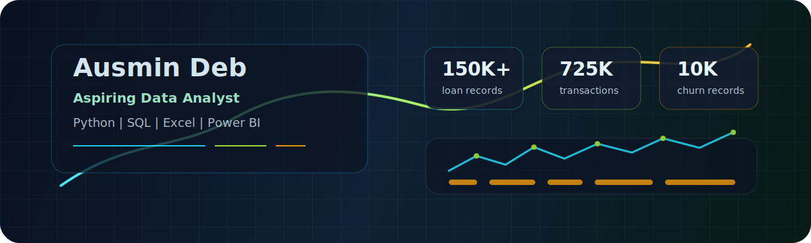

  

<h1 align="center">Ausmin Deb</h1>

  <strong>Aspiring Data Analyst</strong> | Integrated MBA in Data Analytics | Python, SQL, Excel

  
  
  

---

## Analyst Snapshot

I am a 3rd-year Integrated MBA student at DBS Global University, Dehradun, majoring in Data Analytics with a Finance minor. I build analysis projects that connect business questions with measurable insights across churn, credit risk, retail segmentation, and SQL-based decision support.

| Focus | Current Signal |
|---|---|
| Internship target | Data Analyst roles across FMCG, E-commerce, BFSI, and Consulting |
| Core strengths | Exploratory analysis, business storytelling, segmentation, dashboard thinking |
| Currently improving | Intermediate SQL, Python for analysis, Pandas, Power BI |
| Preferred work | Turning raw customer, finance, and retail data into decisions |

## Portfolio Highlights

| Project | Business Question | Evidence | Stack | Links |
|---|---|---|---|---|
| Loan Default Risk Analysis | Which borrower signals are tied to higher default risk? | Analyzed 150K+ loan records. Found a 60.45% default rate at 3+ late payments and 3.8x higher default risk in the under-30 segment. | Python, Pandas, Matplotlib, Risk Analytics | [Repository](https://github.com/Ausmin787/loan-default-analysis) |
| Customer Churn Analysis + Dashboard | Why do customers leave, and which customer groups need attention? | Analyzed 10K banking customers. Found churned customers held 25% higher average balances and Germany had 2x churn rate versus other regions. | Python, EDA, Next.js, Recharts, Vercel | [Repository](https://github.com/Ausmin787/customer-churn-analysis) · [Dashboard](https://customer-churn-dashboard-delta.vercel.app) |
| E-commerce RFM Segmentation | Which customer segments drive revenue and recovery potential? | Segmented 5,350 UK customers across 725K transactions using RFM and K-means. Champions were 18.8% of customers but drove 71% of revenue. | Python, K-Means, RFM, Next.js, shadcn/ui | [Repository](https://github.com/Ausmin787/Ecommerce-rfm-analysis) · [Dashboard](https://dashboard-peach-three-87.vercel.app) |
| Route-to-Retail SQL | How can retail data be structured for clear query-led analysis? | Built a SQL-focused analytics project for retail-style decision questions and repeatable querying practice. | SQL, Python | [Repository](https://github.com/Ausmin787/route-to-retail-sql) |

## Technical Toolkit

<table>
  <tr>
    <td><strong>Analysis</strong></td>
    <td>Excel, SQL, Python, Pandas, NumPy</td>
  </tr>
  <tr>
    <td><strong>Visualization</strong></td>
    <td>Matplotlib, Recharts, dashboard storytelling, Power BI learning path</td>
  </tr>
  <tr>
    <td><strong>Platforms</strong></td>
    <td>GitHub, Vercel, VS Code, Jupyter Notebook, Google Colab</td>
  </tr>
  <tr>
    <td><strong>Web Dashboards</strong></td>
    <td>Next.js, shadcn/ui, deployed analytics dashboards</td>
  </tr>
</table>

## Certifications

| Area | Certification |
|---|---|
| Excel Analytics | Data Analysis using Excel - Great Learning Academy |
| Business Dashboards | Excel Dashboards for Business Analytics - Great Learning Academy |
| Statistics | Basic Statistics - University of Amsterdam / Coursera |
| Business Analysis | Automation Business Analysis - UiPath + IIBA / Coursera |
| GenAI Analytics | Tata GenAI Data Analytics - Forage, Cert ID: Wn7iYLkgD56TJtfG2 |

## What I Am Building Toward

- Stronger SQL analysis through retail and business case projects.
- Cleaner Python notebooks with reproducible EDA and business-focused summaries.
- Power BI dashboards that translate analysis into decision-ready views.
- Internship-ready case studies for FMCG, E-commerce, BFSI, and Consulting roles.

## Contact

  
  
  

  <i>Data is useful when it changes the decision.</i>

